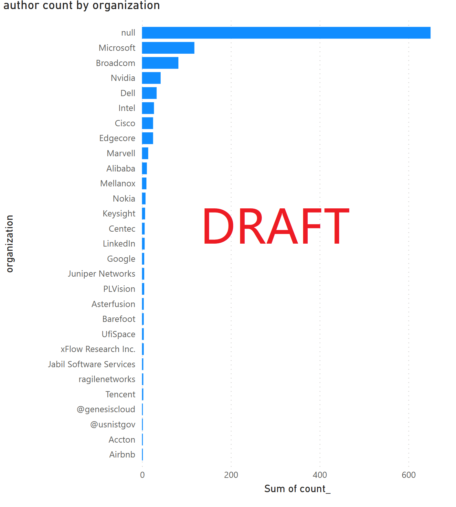
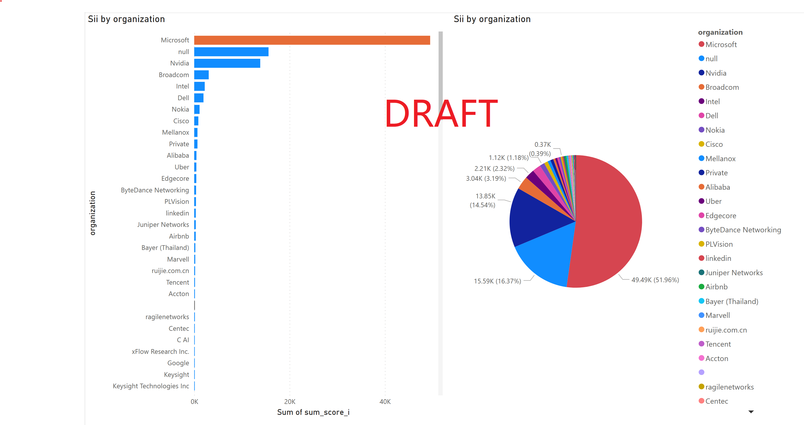
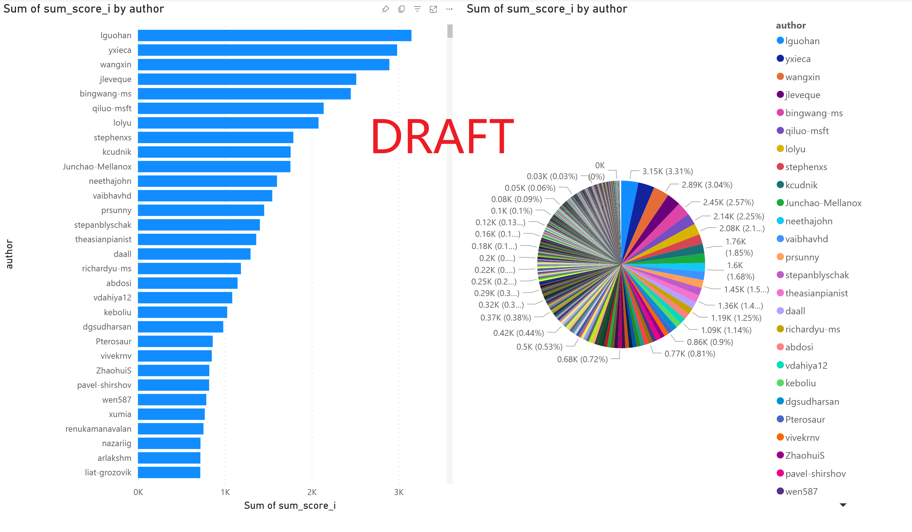
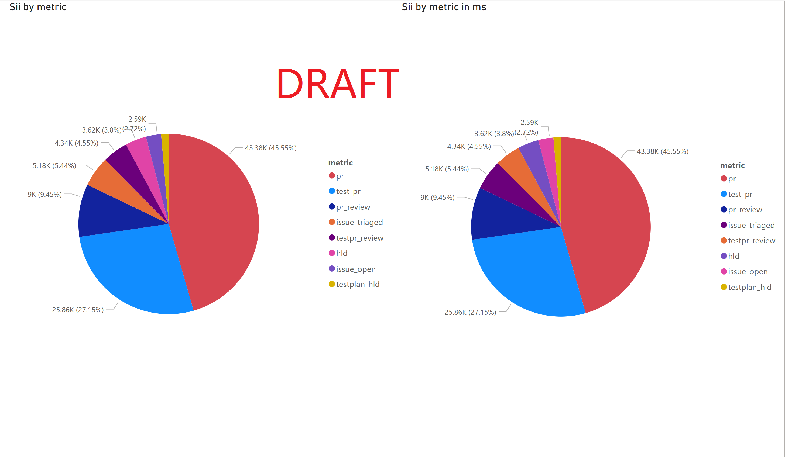

Script to dump infomation from github.
Dumped data.

data status:
| item | data file|
|--|--|
| Merged HLD [1] Count | sii_hld/*.csv |
| Merged PR [2] Count (S/M/L) | sii_pr_review/**/*.prs.json |
| PR Review Count (S/M/L) | sii_pr_review/**/*.reviews.json |
| PR cherry-picking [3] Count | NA |
| Documentations (Release Notes/Meeting Minutes) | sii_hld/*.csv |
| New ASIC [4] Introduction Count | NA |
| Issues Opened Count | sii_issue/issues.json |
| Issues Triaged/Fixed Count | sii_issue/issues.json |
| Merged SONiC MGMT TEST Plan HLD [1] Count | sii_testplan_hld/sonic-mgmt_hld.csv |
| Merged Test cases [2] (S/M/L) | sii_test_pr_review(working) |
| TEST PR review count (S/M/L) | sii_test_pr_review(working) |
| Summit Presentation Count | NA |
| Hackathon Participation Team Count | NA |
| SONiC Production Deployment (S/M/L) [6] | NA |
| SONiC End Consumer Proliferation (S/M/L) | NA |

